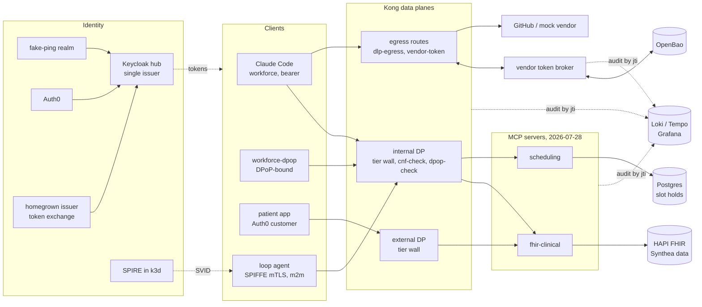

# mcp-healthcare-reference

[](https://github.com/chief-builder/mcp-healthcare-reference/actions/workflows/ci.yml)
[](LICENSE)

A home-lab reference implementation of an enterprise
[Model Context Protocol](https://modelcontextprotocol.io) (MCP) platform for
healthcare, built over synthetic FHIR data. One identity hub (Keycloak) issues
every token, normalizing three upstream identity sources; a Kong gateway
enforces tier audiences, certificate-bound machine identity, and DPoP
sender-constraint; two stateless MCP servers speaking **MCP 2026-07-28**
re-validate every token, scope, and patient compartment themselves; outbound
calls to SaaS vendors pass DLP and get their vendor credential from a
vault-backed token broker; and every hop writes an audit record that one
`jti` query joins end to end.

## Why it matters

Putting AI agents in front of clinical systems raises questions that a demo
server never answers: who is the caller *really* (human, agent, or both), can a
token minted for one system be replayed at another, what stops an agent from
reading every patient, how do vendor credentials stay out of agents' hands, and
can you prove afterwards what happened. This repo answers them with running
code and tests rather than slides: each architectural claim in
[`docs/`](docs/) maps to an enforcement point and an acceptance test that
fails if the control is removed.

## Architecture



The five architectural invariants, the three gateway tiers (internal, external,
egress — on two data planes), and the HIPAA mapping are in the
[reference architecture](docs/mcp-e2e-reference-architecture.md); the token
every component validates is defined in the
[claims contract](docs/mcp-token-claims-contract.md).

| Control                                                    | Enforced by                                                                                            | Proven by                                                     |
| ---------------------------------------------------------- | ------------------------------------------------------------------------------------------------------ | ------------------------------------------------------------- |
| Single issuer, contract-exact tokens (PS256/ES256 only)    | Keycloak realm export; `servers/shared/src/token-verifier.ts`; `broker/app/hub.py`                    | `tests/phase1`, server and broker unit tests                  |
| Two-level audiences; cross-tier replay fails               | Kong tier-wall pre-function; server audience binding                                                   | `tests/phase2`, `tests/phase7` P1                             |
| Per-tool step-up scope, MFA for clinical scopes            | `servers/shared/src/tool-policy.ts`                                                                    | `tests/phase3`, `servers/*/test`                              |
| Patient compartment                                        | `servers/fhir-clinical/src/authz-hook.ts`                                                               | `tests/phase3/test_compartment.py`                            |
| Stateless MCP (no sessions, explicit handles)              | SDK v2 `createMcpHandler`; Postgres-backed `slot_hold_id`                                               | `tests/phase3/test_statelessness.py` (kills a replica)        |
| Certificate-bound m2m (`cnf.x5t#S256`)                     | SPIRE SVIDs; Keycloak client-x509; `plugins/cnf-check`                                                 | `tests/phase4`                                                |
| DPoP sender-constraint (`cnf.jkt`)                         | `plugins/dpop-check` (gateway-first); `servers/shared/src/dpop.ts` (authoritative)                     | `tests/phase7` P8, `plugins/tests`                            |
| Egress DLP and brokered vendor credentials                 | `plugins/dlp-egress`, `plugins/vendor-token`, `broker/`                                                | `tests/phase5`, `plugins/tests`, `broker/tests`               |
| Single-flight refresh, no-issuance rule                    | `broker/app/main.py` (per-entry lock + KV v2 CAS)                                                      | `tests/phase5`, `broker/tests`                                |
| `jti`-joinable audit spine                                 | JSON audit lines + Kong OpenTelemetry → Alloy/OTel → Loki/Tempo                                         | `tests/phase6`                                                |

## Quickstart

### Prerequisites

| Tool                   | Version                       | Needed for                    |
| ---------------------- | ----------------------------- | ----------------------------- |
| Node.js                | 24 LTS (`.nvmrc`)             | servers, offline tests        |
| Python                 | 3.14 (`.python-version`)      | broker, test suites           |
| Docker with Compose v2 | ~8 GB RAM for the full stack  | everything below the offline tier |
| `jq`, `openssl`, `curl`| any recent                    | setup scripts, gates          |
| `shellcheck`           | any recent                    | `make lint`                   |
| `deck`, `k3d`, `kubectl` | see `compose/phase2`, `phase4` | full lab only               |

### 1. Offline checks (no accounts, ~2 minutes)

```sh
git clone https://github.com/chief-builder/mcp-healthcare-reference.git
cd mcp-healthcare-reference
make install          # .venv + servers/node_modules
make test             # servers, broker, kit vectors, gateway plugins (Docker)
make lint format-check typecheck build
```

`make test` runs the MCP servers' and broker's unit and integration suites
with coverage, the claim-vector conformance layer of the kit, and the four Kong
plugins against a DB-less Kong 3.16 in Docker. Nothing external is contacted
except image pulls.

### 2. Identity and data lab — phases 0–1 (no accounts)

```sh
cd compose/phase1
cp .env.example .env               # then replace every change-me value
docker compose up -d --build
./setup-phase1.sh                  # waits for Keycloak, applies post-import config
FHIR_BASE=http://localhost:8081/fhir ../phase0/seed-synthea.sh   # ~50 synthetic patients
../../tests/phase1.sh              # claims contract + IdP normalization gate
```

The Auth0 leg of the phase 1 gate skips unless an Auth0 tenant is configured
in `.env` (see `compose/phase1/README.md`). Phase 0 alone (Keycloak, HAPI, and
the observability spine) is `compose/phase0/README.md`.

### 3. Full lab — phases 2–7

Phases 2 onward run real Kong Konnect hybrid data planes, so they need a
[Kong Konnect](https://konghq.com/products/kong-konnect) account and a personal
access token (`KONNECT_TOKEN` in `compose/phaseN/.env`), plus `deck`. Phase 4
adds SPIRE in a k3d cluster; phase 5 optionally uses a GitHub App for the real
vendor leg (the mock vendor covers every gate). Each phase's bring-up is in
`compose/phaseN/README.md`; `compose/phase5` runs everything, and the phase 6
audit spine rides it.

## Configuration

Every component reads its configuration from the environment and validates it
at startup. The authoritative lists:

| Component              | Where                                                                  |
| ---------------------- | ---------------------------------------------------------------------- |
| MCP servers            | [`servers/README.md#configuration`](servers/README.md#configuration)   |
| Vendor token broker    | [`broker/README.md#configuration`](broker/README.md#configuration)     |
| Lab stacks (secrets, accounts) | `compose/phaseN/.env.example` (copy to `.env`, never commit it) |
| Identity                | `realm/*.json` (Keycloak exports) + `compose/phase1/setup-phase1.sh`   |
| Gateway                 | `deck/*.yaml` (decK, config-as-git) + `plugins/`                      |
| Vendors                 | `broker/registry.json` (scope ceilings are reviewed commits)          |

## Tests

| Suite                         | Command                    | Needs                     |
| ----------------------------- | -------------------------- | ------------------------- |
| MCP servers (vitest)          | `make test-servers`        | Node                      |
| Broker (pytest)               | `make test-broker`         | Python                    |
| Kit claim vectors             | `make test-kit`            | Python                    |
| Gateway plugins (DB-less Kong)| `make test-plugins`        | Docker                    |
| Phase gates 0–1               | `tests/phase0.sh`, `tests/phase1.sh` | the phase 1 stack |
| Phase gates 2–7               | `tests/phase2.sh` … `tests/phase7.sh` | the phase 5 stack + Konnect |

`tests/phase7.sh` is the red-team suite: cross-tier replay, scope ceilings,
broker state replay, RFC 9207 `iss` tamper and omission, mass-STALE paging,
token-in-log greps, the broker no-issuance rule, and DPoP probes. See
[`tests/README.md`](tests/README.md).

## Project status and limitations

As of 2026-09-30: the offline suites and the phase 0–1 gates pass on this
branch from a clean clone. Phases 2–7 last passed on 2026-07-16, before the
MCP 2026-07-28 migration and the image upgrades; re-running them needs a valid
Konnect token. Release history: [`CHANGELOG.md`](CHANGELOG.md).

Known limitations — this is a lab, not production software:

- Lab substitutions are deliberate and listed in
  [prototype plan §2](docs/prototype-plan.md) and claims contract §4: OpenBao in
  dev mode instead of KMS envelope encryption, a single broker replica with
  in-process locks, a Keycloak realm standing in for Ping, compose-network
  isolation instead of mTLS between the gateway and the broker.
- The data planes do not verify token signatures on first-party MCP routes (the
  tier wall decodes; the servers verify). This is the documented split, not an
  oversight.
- The `claude-code` client is plain bearer: real Claude Code sends no DPoP
  proofs. Sender-constraint is demonstrated on the parallel `workforce-dpop`
  client.
- The external-tier Client ID Metadata Document control is not implemented
  (issue #3).
- DLP is pattern-based (MRN and SSN regexes over raw and JSON-decoded bodies),
  not a classifier.
- Keycloak 26.7 marks the `token-exchange:v1` and `admin-fine-grained-authz:v1`
  features the lab relies on as deprecated.
- Synthetic data only (Synthea). Never point this at real PHI.

## Documents

- [End-to-End Reference Architecture](docs/mcp-e2e-reference-architecture.md) — the five invariants, tiers, HIPAA mapping, WAF appendix
- [Token Claims Contract](docs/mcp-token-claims-contract.md) — the canonical JWT every component validates
- [Vendor Token Broker Design](docs/vendor-token-broker-design.md) — consent dance, refresh race, vault schema
- [Prototype Plan](docs/prototype-plan.md) — fidelity contract, substitution map, phases 0–7
- [Enterprise rollout kit](kit/README.md) — portable acceptance probes, blueprints, adapters, compliance mapping, playbook
- [overview.html](overview.html) — rendered tour of the repo and phase status
- Stakeholder pages, published at
  [chief-builder.github.io/mcp-healthcare-reference-docs](https://chief-builder.github.io/mcp-healthcare-reference-docs/):
  [product showcase](docs/showcase/product.html),
  [technical overview](docs/showcase/technical-overview.html),
  [token lifecycle](docs/showcase/token-lifecycle.html), and the verified
  walkthroughs ([modules — functional](docs/walkthrough/modules-functional.html),
  [modules — technical](docs/walkthrough/modules-technical.html),
  [overall — functional](docs/walkthrough/overall-functional.html),
  [overall — technical](docs/walkthrough/overall-technical.html)).

## Repository layout

| Path        | Contents                                                                 |
| ----------- | ------------------------------------------------------------------------ |
| `servers/`  | MCP servers (npm workspace: `shared/`, `fhir-clinical/`, `scheduling/`)  |
| `broker/`   | Vendor token broker (FastAPI) and its tests                              |
| `plugins/`  | Custom Kong plugins and their DB-less test suite                        |
| `deck/`     | Kong gateway configuration (decK)                                        |
| `realm/`    | Keycloak realm exports                                                   |
| `compose/`  | One Docker Compose stack per phase, plus setup scripts and k8s manifests |
| `agents/`   | The m2m loop agent (SPIFFE workload)                                     |
| `tests/`    | Live acceptance gates, one per phase                                     |
| `kit/`      | Enterprise rollout kit: portable probes, blueprints, adapters, playbook  |
| `docs/`     | Design documents and the stakeholder site                                |

Contributing: [`CONTRIBUTING.md`](CONTRIBUTING.md). Security reports:
[`SECURITY.md`](SECURITY.md).

## License

[MIT](LICENSE) © 2026 chief-builder.
