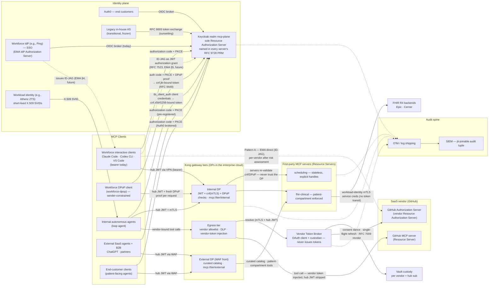

# Enterprise MCP Platform — End-to-End Reference Architecture

**Version:** 1.0-draft &nbsp;|&nbsp; **Status:** For architecture review &nbsp;|&nbsp; **Owner:** API Gateway Platform
**Companion documents:** MCP Platform Token Claims Contract v1.0 · Vendor Token Broker Design v1.0 · SaaS Connector Onboarding Standard (TBD) · ADR set (TBD)

---

## 1. Executive summary

This document defines the target architecture for deploying the Model Context Protocol (MCP) as governed enterprise infrastructure in a HIPAA-regulated environment. It connects four client populations (workforce developers, internal autonomous agents, external SaaS agents, and end customers) to two classes of MCP destination (first-party servers fronting clinical and business systems, and third-party SaaS MCP servers), through a Kong Konnect hybrid gateway estate, under a single-issuer token model anchored in Keycloak and a certificate-based workload identity layer anchored in an attestation-based workload identity system (Athenz in the worked examples below; SPIFFE/SPIRE in the lab).

Five invariants define the design; every section below is an elaboration of one of them:

1. **One token issuer for the MCP plane.** Keycloak mints every token that a Kong data plane or MCP server validates. The workforce IdP, the workload identity system, the customer IdP (Auth0), and (transitionally) a legacy in-house authorization server authenticate their populations; none of their tokens reach the plane directly.
2. **PHI stays inside the enterprise's own cloud boundary.** The Konnect control plane (Kong's cloud accounts) receives configuration and aggregate telemetry only; vendor clouds receive only DLP-screened, allowlisted tool traffic; audit flows to the enterprise SIEM, never through Konnect.
3. **Stateless MCP from day one.** All first-party servers implement the 2026-07-28 specification revision: no protocol session, identity and capabilities on every request, horizontal scaling behind ordinary load balancing. (The lab's servers speak it natively via the MCP TypeScript SDK v2, with the SDK's stateless 2025-11-25 fallback for clients that have not migrated.)
4. **Governance at two layers, never conflated.** Enterprise-Managed Authorization (EMA) / IdP policy governs *connections* — the spec itself scopes IdP visibility to access-token issuance, not MCP traffic (EMA §7.2); Kong ACLs and MCP-server scope checks govern *tool calls*. No control assumes the other's job is done.
5. **Every transitional component has a defined exit.** The legacy in-house AS sunsets into the workload-identity path + Keycloak; the vendor token broker shrinks vendor-by-vendor as EMA/ID-JAG adoption spreads; the workforce IdP's brokered leg upgrades in place to ID-JAG.

## 2. Scope

In scope: MCP client connectivity, identity and token architecture, gateway topology (internal, external, egress tiers), first-party MCP server platform, SaaS MCP consumption, audit, and the HIPAA control mapping for all of the above. Out of scope: model/LLM selection and hosting, agent application design, EHR-side integration engineering, and the FHIR facade internals (owned by the clinical integration team).

## 3. Specification and standards baseline

| Layer | Baseline | Notes |
|---|---|---|
| MCP core | 2026-07-28 revision (current) | Stateless transport; `_meta` version/capability carriage; `server/discover`; explicit state handles as tool arguments. Lab: MCP TypeScript SDK v2 (`@modelcontextprotocol/server`); offline integration tests pin the official v2 client to 2026-07-28. A formal conformance suite in CI is still to come. |
| MCP authorization extensions | Enterprise-Managed Authorization (EMA, **stable**, modelcontextprotocol/ext-auth) — an application of the Identity Assertion JWT Authorization Grant (ID-JAG, draft-ietf-oauth-identity-assertion-authz-grant) | Adopted per leg where the IdP issues ID-JAGs; support discovered via `urn:ietf:params:oauth:grant-profile:id-jag` in the Resource Authorization Server's `authorization_grant_profiles_supported` metadata (EMA §6) |
| Authorization discovery | RFC 9728 Protected Resource Metadata | Every first-party MCP server advertises Keycloak as its AS |
| Token grammar | OAuth 2.1; RFC 8707 resource indicators; RFC 8693 token exchange; RFC 8705 mTLS client auth + certificate-bound tokens | Enforced per the Claims Contract |
| Client identity | Client ID Metadata Documents (draft-ietf-oauth-client-id-metadata-document) > pre-registration > DCR (deprecated in 2026-07-28) | Per-tier policy in §5.1 |
| Authorization response integrity | RFC 9207 issuer identification | Keycloak advertises `authorization_response_iss_parameter_supported`; every OAuth client we operate (broker included) validates `iss` with strict string comparison |
| Client hardening | RFC 9700 OAuth Security BCP | Normative for the token broker and all confidential clients |
| Workload identity | An attestation-based workload identity system issuing SPIFFE-compatible X.509 SVIDs (e.g., Athenz, SPIFFE/SPIRE; the lab uses SPIRE) | Cert lifetime ≤ 30 days |
| Healthcare data | FHIR R4; SMART-style patient scopes | Patient compartment enforced in MCP servers |
| Regulatory | HIPAA Security Rule incl. 2025 amendments | Mandatory encryption (FIPS 140-3), agent-inclusive risk analysis, audit controls |

## 4. Identity plane

Four authoritative identity systems converge on Keycloak (realm `mcp-plane`), which is the sole Resource Authorization Server for every MCP audience.

**Workforce IdP (e.g., Ping, Okta, Entra ID).** Brokered into Keycloak via OIDC (the lab stands in a second Keycloak realm, `fake-ping`). Interactive clients (Claude Code, Codex CLI, VS Code) perform authorization code + PKCE through the brokered login. Claude-family clients are EMA-capable; the day the workforce IdP ships ID-JAG issuance the front leg upgrades to the EMA flow — the MCP Client exchanges its IdP identity assertion for an ID-JAG (RFC 8693 token exchange at the IdP, EMA §4) and presents it at Keycloak's token endpoint as a JWT authorization grant (RFC 7523, EMA §5), with zero downstream change. In EMA role terms the workforce IdP is the IdP Authorization Server and Keycloak stays the Resource Authorization Server. This is a deferred upgrade, not a blocker.

**Workload identity (target state for all m2m).** The workload identity system (e.g., Athenz ZTS, or SPIRE as in the lab) issues short-lived X.509 SVIDs to attested workloads and rotates them without restarts. Agents perform `tls_client_auth` client-credentials at Keycloak and receive certificate-bound tokens (`cnf.x5t#S256`). No client secrets exist on this path. On-behalf-of flows use RFC 8693 exchange producing `sub` = user, `act.sub` = agent.

**Sender-constrained tokens — two bindings, one `cnf` doctrine.** Interactive workforce tokens are bearer tokens: whoever holds one can replay it for its remaining life from any device that can reach the tier. The workloads path already closes this with the certificate binding above; the public-client analogue is DPoP (RFC 9449), where the token carries `cnf.jkt` — the thumbprint of a client-held key — and every request presents a fresh signed proof. Enforcement is gateway-first and defense-in-depth: a `dpop-check` DP plugin (sibling to `cnf-check`) rejects early, and each MCP server's `requireDpop` middleware is the authoritative re-check. Proven end-to-end on the `workforce-dpop` client (claims contract §6.6, prototype plan Phase 7).

**Legacy in-house AS (transitional, frozen).** Registered as a trusted external issuer for RFC 8693 exchange only (the lab's `homegrown` issuer). No new onboarding; each service migrating to the workload-identity path removes an issuer mapping; the leg is deleted when empty. Rationale: retire a bespoke token-issuance surface from HIPAA assessment scope.

**Auth0 (end customers).** Brokered into Keycloak; tokens carry SMART-style `patient/...` scopes and a mandatory `fhir_patient` compartment claim resolved from the customer↔patient linkage store. Customer tokens are structurally incapable of reaching another patient's record. Auth0's Okta lineage means native ID-JAG issuance (Okta's product name: Cross App Access) may arrive here before the workforce leg.

**Third parties (ChatGPT, B2B).** Native Keycloak clients: pre-registered, pinned redirect URIs, dynamic client registration disabled, per-user consent retained deliberately. External-tier audience only.

All tokens conform to the Claims Contract: `PS256`/`ES256` on FIPS modules, 5–10 minute lifetimes, two-level audiences (`mcp://tier/*` + `mcp://srv/*`), normalized `groups` vocabulary, no directory PII, `mcp_contract` version pinning.

## 5. Gateway topology (Kong Konnect hybrid)

**Control/data split.** Konnect control planes run in Kong's cloud accounts; all data planes run in the enterprise's own cloud accounts (AWS in this reference). The cross-boundary channel is DP-initiated mTLS on 443 carrying configuration down and aggregate telemetry up; request payloads never cross (Konnect Debugger disabled by policy on these control planes; no PHI-adjacent strings in entity names or labels). DPs continue serving from cached config during CP unavailability — a Konnect outage degrades change management, not patient-facing traffic. DP local config cache resides on KMS-encrypted volumes; secrets resolve via vault references; DP fleet runs FIPS-mode Enterprise builds. All config flows through decK/Terraform in CI/CD (change-management evidence); CP↔DP major-version pinning is enforced in node groups.

**Three data-plane tiers, one claims contract:**

| Tier | Serves | Route set | Distinctive policy |
|---|---|---|---|
| Internal | Workforce clients via VPN + private NLB; internal agents east-west | Full first-party catalog | JWT + `cnf` sender-constraint (mTLS `x5t#S256` for agents, DPoP `jkt` for the workforce-dpop client); role-scoped MCP ACLs; guardrails |
| External | ChatGPT/B2B and patient apps via WAF + public ALB (edge controls: Appendix A) | Curated catalog only (PHI-free until per-tool compliance approval; patient-compartment tools for Auth0 tokens) | Aggressive rate/response limits; outbound PII guardrails; separate control plane so misconfig cannot expose internal tools |
| Egress | Corporate clients and internal agents calling SaaS MCP servers | Brokered vendor routes (`mcp://egress/*` audiences) | Tool allowlists per vendor; outbound DLP tuned for PHI signatures; vendor-token injection via broker; hub JWT stripped upstream |

Tier isolation is cryptographic, not just topological: tier audiences in every token make cross-tier replay fail signature-independent validation.

**Master diagram** — every client population, token path, and flow in one view. Solid edges are current state; dashed labeled edges are the future EMA (ID-JAG) upgrade paths; unlabeled dashed edges feed the audit spine. Token binding is shown per client: the autonomous agents are mTLS/cert-bound (`cnf.x5t#S256`) and the `workforce-dpop` client is DPoP/key-bound (`cnf.jkt`) — two bindings, one `cnf` doctrine, each enforced at the DP and re-validated at the server.

**Diagram note:** the master diagram draws the egress feed from the internal-agents node for routing clarity; developer clients reach the egress tier through the same private ingress, and the external tier has no route to egress by construction.

### 5.1 Client registration policy (2026-07-28 authorization spec alignment)

The 2026-07-28 spec reorders registration mechanisms: Client ID Metadata Documents (CIMD — the client_id is an HTTPS URL from which the AS fetches self-described metadata) is the SHOULD, pre-registration remains supported, and Dynamic Client Registration is **deprecated**. Our original "DCR disabled" stance is thereby validated by the spec's own direction. Per-tier policy:

- **Internal tier:** pre-registered clients only. CIMD adds nothing where we control both sides.
- **External tier:** pre-registration remains the baseline; CIMD is supported behind an **origin allowlist** (target state; see the gap register below) — Keycloak's native CIMD client policy accepts URL-form `client_id` values only from vetted metadata origins (e.g., the published metadata URLs of Claude, VS Code, ChatGPT). Open CIMD acceptance is equivalent to open DCR and is refused: in a healthcare context, "any HTTPS URL may become a client" is not a consent posture we accept. Redirect-URI validation follows the CIMD document exactly; metadata fetches are cached with the spec's freshness rules.
- **Gap register (CIMD, issue #3):** Keycloak has native CIMD since 26.6 (feature `cimd`; a `client-id-uri` client-policy condition plus a `client-id-metadata-document` executor whose permitted-domains list *is* the origin allowlist), so no policy shim is needed. It is not enabled in the lab: Keycloak labels it **experimental**, and as of 26.7.5 PKCE is not enforced for CIMD clients ([keycloak#52795](https://github.com/keycloak/keycloak/issues/52795)), a metadata document's `scope` field can request realm scopes, and there is no special-use-IP check on metadata fetches (the CIMD draft makes that a MUST). Turning it on today would weaken a posture that currently fails closed (`tests/phase7` asserts URL-form client_ids are refused). Trigger to implement: CIMD leaves experimental or #52795 is fixed; the plan is recorded on issue #3.
- **Gap register (DPoP):** (a) `claude-code` stays a bearer client until real Claude Code ships DPoP proof support — the binding is proven on the parallel `workforce-dpop` client instead. (b) The DPoP nonce round (`use_dpop_nonce`, RFC 9449 §8/§9) is deferred; the ±60 s `iat` window + `ath` binding + DP `jti` dedup bound the pre-generation window acceptably for the lab. (c) The DP plugin, consistent with the DP doing no cryptographic token validation on first-party routes, verifies proof structure and binding but not the ECDSA signature — the servers' `requireDpop` (jose) is authoritative for the signature. (d) Server-side `jti` replay dedup is absent by design (stateless replicas); the single-entry DP's shared dict is authoritative, and production would use a shared cache (Redis `SET NX EX`, key `jkt:jti`, TTL = the freshness window).

### 5.2 Authorization responses and scope challenges

All tiers implement the spec's error and step-up semantics: 401 challenges carry `resource_metadata` and a `scope` parameter naming the scopes for the attempted operation; runtime insufficient-permission responses are `403` with `error="insufficient_scope"` and the full required scope set in a **single challenge** (never incremental dribble). `scopes_supported` in each server's PRM lists the *minimal baseline* only — broad and clinical scopes are issued exclusively via challenge-driven step-up, which makes the spec's step-up flow our minimum-necessary mechanism rather than a UX afterthought: external and patient-facing clients start with the floor and escalate per operation, with every escalation consented and audited. `offline_access` never appears in PRM `scopes_supported` or WWW-Authenticate challenges. All OAuth clients we operate validate RFC 9207 `iss` on authorization responses (including error responses) against the recorded issuer before touching the code — strict string comparison, no URI normalization.

## 6. First-party MCP server platform

Servers are generated from existing REST/FHIR APIs via Kong's MCP autogeneration where the API is already well-governed, and hand-built where tool semantics diverge from resource semantics. All servers:

- Implement 2026-07-28 statelessness: any request to any replica; continuity via explicit handles (`case_id`, `worklist_id`) passed as tool arguments — which doubles as audit-friendly design, since every request is self-describing.
- Publish RFC 9728 Protected Resource Metadata naming Keycloak; declare supported extensions via the extensions map.
- Re-validate tokens independently of the gateway (signature, `iss`, own `aud` URI, scope-per-tool, `fhir_patient` compartment where present) — defense in depth per Claims Contract §8.
- Reach FHIR/EHR backends (Epic, Cerner R4) over workload-identity mTLS with least-privilege service credentials from vault references; model context is fetched per request, never cached across principals.
- Emit the audit tuple on every tool invocation.
- Enforce the spec's token isolation MUSTs: accept only tokens minted for their own `aud` by Keycloak, and **never transit an inbound token** to any downstream — FHIR calls use the server's own service credential, and vendor-bound calls (egress tier) carry only the vendor's token. The hub JWT stops at the component that validated it.
- Implement §5.2 challenge semantics: minimal `scopes_supported`, scope-bearing 401s, single-shot `insufficient_scope` 403s driving client step-up.

Promotion gate: MCP conformance suite green, claims-contract validation tests green, and (for any PHI-bearing tool) compliance sign-off recorded in the tool registry.

## 7. SaaS MCP consumption (GitHub, Notion, ...)

Two sanctioned patterns, stackable where the vendor supports both:

**Pattern A — EMA direct.** For vendors whose Resource Authorization Server supports the ID-JAG grant profile, discovered via `urn:ietf:params:oauth:grant-profile:id-jag` in `authorization_grant_profiles_supported` (EMA §6; current set includes Asana, Atlassian, Canva, Figma, Granola, Linear, Supabase; growing). IdP policy governs the connection centrally (EMA §4.1); traffic flows client→vendor. Granted per-vendor only after a risk assessment concludes the connector cannot plausibly carry PHI, and only for enterprise-managed clients.

**Pattern B — governed egress (default).** All corporate SaaS MCP traffic routes through the egress tier: vendor tool allowlist, outbound DLP (MRN/name/code-pattern screening — the control that prevents reportable disclosures to non-BAA vendors), full audit tuple, and vendor-token injection. Credentials are acquired per-user through the Vendor Token Broker (companion doc): org-owned vendor apps, one-time OAuth consent, vault custody keyed by hub `sub`, single-flight rotating-refresh handling, RFC 7009 revocation on offboarding. No PATs, no shared service accounts, no credentials on laptops.

External-tier clients (ChatGPT et al.) never receive SaaS passthrough. Approved vendors and their brokered endpoints publish to the Konnect MCP Registry, making the registry the single catalog of sanctioned connectivity for humans and agents alike.

## 8. HIPAA control mapping

| Requirement | Implementing control |
|---|---|
| Encryption in transit/at rest (2025: mandatory) | FIPS 140-3 modules end to end; TLS everywhere; KMS-encrypted DP caches and vault |
| Access control / unique identification | Hub-issued tokens with `sub`+`act` on every request; per-user vendor credentials; no shared accounts on any path |
| Minimum necessary | Tier catalogs → role-scoped tool ACLs → per-tool scopes → patient compartment filtering |
| Audit controls / accounting of disclosures | Per-tool-call tuple (`jti`, `sub`, `act.sub`, `azp`, `idp_origin`, tier, tool, verb, `fhir_patient`, decision) from DPs and servers to the enterprise SIEM |
| Risk analysis incl. AI agents (2025) | The workload identity system's registry (e.g., Athenz ZMS) as authoritative workload inventory; Konnect Registry as connectivity inventory; both change-managed into SIEM |
| BAA chain | First-party plane: assessed with counsel (Konnect designed to carry no PHI); vendor SaaS: PHI egress prevented by DLP + allowlists, obviating vendor BAAs for Pattern B scope |
| Workforce MFA | `amr` propagation from the workforce IdP; `mfa` required for clinical tool scopes (lab: enforced by the FHIR server for the scopes in `MCP_MFA_SCOPES` — `401 insufficient_user_authentication`, RFC 9470) |

## 9. Audit and observability

One vocabulary (Claims Contract §9) across gateway, servers, broker, and identity events; `jti` joins a vendor-side action to the exact tool call and human/agent that caused it. Konnect analytics is used for capacity and health only — never as the compliance record. OTel traces span client→DP→server→backend; SLO dashboards per tier; anomaly rules include: `auth0`-origin token at internal tier, `cnf` mismatch, mass-STALE broker events, external-tier scope-ceiling probes.

## 10. Deployment and network

DPs, MCP servers, Keycloak, broker, and workload-identity components run on Kubernetes (EKS in this reference) across ≥2 AZs in the enterprise's own accounts; east-west over private DNS with workload-identity mTLS; no public exposure except the WAF'd external ALB and the Konnect 443 egress (pinned to Kong's published regional endpoints, optionally via forward proxy). Private ingress via Client VPN with device posture. Vendor egress NAT is allowlisted to registered vendor hostnames only.

## 11. Migration ledger

| Transition | Mechanism | Exit test |
|---|---|---|
| Legacy in-house AS → workload identity + Keycloak | Dual grant paths per service; issuer-trust mappings removed per migration | Zero mappings; profile deleted from Claims Contract |
| Workforce IdP broker → EMA (ID-JAG) | Front-leg swap at Keycloak when the IdP ships ID-JAG | 30-day dual-run parity in SIEM |
| Broker per-vendor → EMA direct | Sunset criteria (Broker doc §15) | Vendor registry entry disabled; grants revoked on drain |
| 2025-11-25 → 2026-07-28 servers | Built stateless from day one; SDK v2 migration with a stateless 2025 fallback for unmigrated clients (done in the lab) | Conformance suite green on all servers; fallback retired when client telemetry shows no 2025-era traffic |

## 12. Risks and accepted trade-offs

Fail-closed vault behavior on the broker trades availability for credential safety (revisit if egress becomes clinical-critical). Kong's MCP support is a plugin layer atop a general gateway — accepted where Kong is already the enterprise's API gateway, and revisited if purpose-built gateways materially outpace it. The workforce IdP's ID-JAG timeline is outside our control — mitigated by the hub design. Per-user vendor tokens multiply consent events at rollout — accepted as one-time cost with self-enrolling onboarding. Custom `cnf`-verification plugin on the DP is bespoke code on the hot path — mitigated by its small surface and dedicated tests.

## 13. Review checklist for approvers

Security: single-issuer invariant, tier audience isolation, cert-bound m2m, broker no-issuance rule. Compliance: §8 mapping, external-tier PHI-free catalog, DLP coverage, audit joinability. Platform: CP/DP version pinning, fail-open/closed decisions, conformance gating. Each companion document carries its own deeper checklist.

---

## Appendix A — Public MCP ingress: WAF rules and edge controls

Organizing principle: the edge handles protocol- and volume-level threats anonymously; everything identity-aware waits one hop for the Kong external DP, where the token is visible. The WAF is never taught about JWTs, and semantic screening (prompt injection, PHI egress) is explicitly **not** an edge responsibility — it lives in the DP guardrail plugins where MCP payloads are parsed with tool context and identity attached. This division is normative: the answer to "where is prompt injection handled" is the gateway, not the WAF.

### A.1 Transport posture

TLS 1.3-preferred ALB security policy (1.2 floor) on FIPS-validated termination; HSTS injected; no plaintext or HTTP/1.0 listeners. ACM certificate carries the external hostname only — nothing at the edge reveals internal naming. Shield Standard assumed; Shield Advanced evaluated (public healthcare endpoint is a credible DDoS target; Advanced adds response-team engagement and cost protection).

### A.2 Managed rule groups and MCP-specific tuning

Baseline: `CommonRuleSet`, `KnownBadInputs`, `IPReputationList`, `AnonymousIPList` (legitimate traffic on this tier originates from known SaaS egress ranges and patient devices, not anonymizing infrastructure). Two tunings driven by MCP's JSON-RPC-over-POST shape:

1. SQLi/XSS body inspection will false-positive on tool arguments containing code or rich text — every rule deploys in count mode with a tuning window before promotion to block.
2. WAF inspects only the leading portion of request bodies (16 KB default, raisable to 64 KB). Oversized requests are therefore **rejected, not passed uninspected**: MCP tool calls on this tier have no legitimate multi-megabyte payloads; bodies are capped (~128 KB) and anything exceeding the inspection limit blocks unless a specific route is deliberately exempted.

### A.3 Protocol shape enforcement

Custom rules encoding what the endpoint is: only POST/GET/DELETE on MCP path prefixes and the OAuth callback paths (everything else, including OPTIONS floods, blocked); `Content-Type: application/json` required on POSTs; `Authorization` header required on MCP routes (unvalidated at the edge, but drops unauthenticated scanner noise before Kong); header-anomaly drops (oversized or duplicate headers). Streaming nuance: streamable HTTP responses may be long-lived — ALB idle timeout is set to the longest sanctioned tool call and no longer, and WAF/ALB response buffering is explicitly tested against streamed delivery before go-live.

### A.4 Rate limiting, split across layers

| Layer | Key | Purpose |
|---|---|---|
| WAF rate rules | Source IP (finer aggregation keys where useful) | Coarse abuse ceiling only — shed the anonymous flood. Deliberately loose: SaaS agents NAT many users through few IPs; a tight per-IP edge limit would throttle the largest legitimate client |
| WAF, OAuth/token paths | IP + path | Stricter rule scoped to consent/token endpoints, where credential-stuffing and consent-phishing probes concentrate |
| Kong external DP | `sub`, `azp` from the validated token | The real fairness enforcement among authenticated principals |

### A.5 Bot control and geography

`BotControlRuleSet` in targeted mode with explicit allow-listing for verified, onboarded SaaS agents (published egress ranges pinned in an IP set tied to that client's routes — belt-and-suspenders alongside its OAuth client auth). Geography: country allowlist matching the patient service area plus sanctioned-country blocks, with a documented exception path for traveling patients.

### A.6 Origin cloaking and response hygiene

ALB reachable only through the WAF association; external DP security groups accept only the ALB. Fingerprinting headers stripped or normalized on this tier (`Server`, `X-Powered-By`, Kong `Via`). Edge errors are generic RFC 9457 problem details — no internal hostnames, and never an echo of the offending payload.

### A.7 Logging and feedback loop

Full WAF logs stream (Kinesis Firehose) to the same SIEM as the §9 tuple; sampled-request visibility on; every rule's lifecycle is count → tuned → block, tracked in change management like DP config. Anomaly correlation: a `KnownBadInputs` spike against MCP paths joins (by IP and time) with DP-side scope-ceiling probes from §9 — one actor, two telemetry layers.

### A.8 Review checklist (edge)

Body-size rejection above inspection limit; streaming timeout tested; count-mode ledger current; SaaS egress IP sets pinned and refreshed; OAuth-path rate rule active; no identity logic at the edge; prompt-injection ownership documented at the DP layer.
