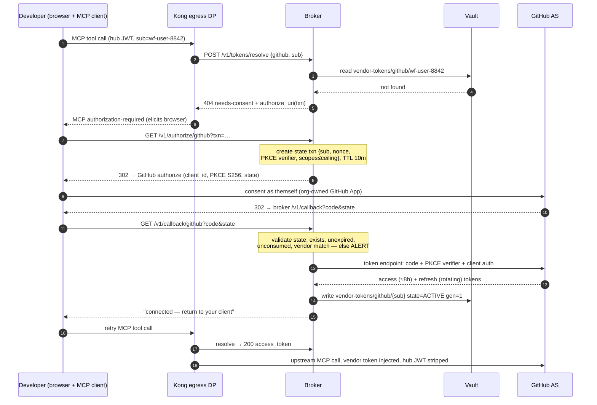
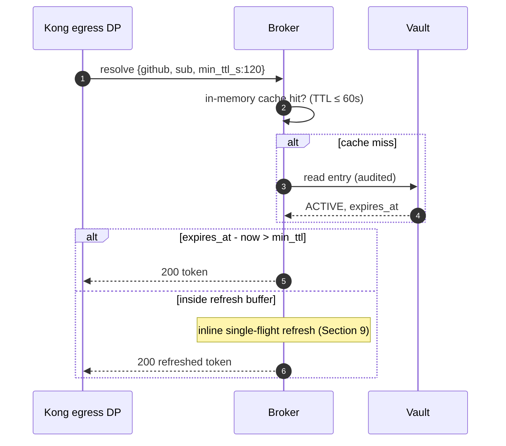

# Vendor Token Broker — Design Document

**Version:** 1.0-draft &nbsp;|&nbsp; **Status:** For architecture review &nbsp;|&nbsp; **Owner:** API Gateway Platform (proposed: homegrown-AS team)
**Related:** MCP Platform Token Claims Contract v1.0 · SaaS Connector Onboarding Standard (TBD) · ADR-xxx "Broker as standalone service"

---

## 1. Role definition

The Vendor Token Broker acquires, custodies, refreshes, and revokes OAuth credentials issued by third-party SaaS authorization servers (GitHub, Notion, Atlassian, ...) on behalf of individual enterprise users, and resolves them per-request for the Kong egress tier.

**The broker is an OAuth client and credential custodian. It is not an authorization server and MUST NOT mint, sign, or transform tokens.** Keycloak remains the sole issuer for the MCP plane (Claims Contract §2). Any future requirement that appears to need broker-issued tokens is a design error to be escalated, not implemented.

The broker exists because most SaaS vendors' authorization servers do not yet accept cross-domain identity assertions (ID-JAG / MCP Enterprise-Managed Authorization). It is deliberately transitional: Section 15 defines per-vendor sunset criteria. Architect every vendor integration as a removable module.

## 2. Standards basis

| Leg | Standard | Broker obligation |
|---|---|---|
| Acquisition | RFC 6749 authorization code + OAuth 2.1 discipline | PKCE (S256) on every flow; exact redirect-URI match; no implicit/password grants |
| Acquisition | RFC 7636 PKCE | Verifier generated and held server-side per transaction |
| Discovery | RFC 8414 AS metadata | Vendor endpoints resolved from `.well-known`; hardcoding forbidden where metadata exists |
| Acquisition | RFC 9126 PAR | Used where the vendor advertises support |
| Acquisition | RFC 9207 issuer identification | Callback validates `iss` (when present or advertised) against the issuer recorded at transaction creation — strict string comparison, no URI normalization; applies to error responses too |
| Hardening | RFC 9700 OAuth 2.0 Security BCP | Normative checklist for the whole client stack; deviations documented per vendor |
| Lifecycle | RFC 6749 §6 refresh | Single-flight refresh per entry (Section 9) |
| Lifecycle | RFC 7009 revocation | Offboarding calls the vendor revocation endpoint before deleting the vault entry |
| Lifecycle | RFC 7662 introspection | Optional health probe where offered |
| Exchange (future) | RFC 8693 / draft-ietf-oauth-identity-chaining / ID-JAG / MCP EMA extension | The standardized replacement; drives Section 15 sunset |

The custodial pattern itself ("store foreign-domain tokens keyed by local identity") has no RFC; it is the token-handler/BFF pattern applied at gateway scale. RFC 9700 discipline plus Sections 10–12 substitute for the missing standard.

## 3. Architecture and trust boundaries

Deployment: EKS, inside the PHI-boundary AWS accounts, egress-restricted to registered vendor AS/API hostnames. Workload identity: Athenz SVID via SIA (Copper Argos), used for (a) mTLS on every inbound API call and (b) `tls_client_auth` if the broker ever needs hub tokens of its own. All crypto on FIPS 140-3 validated modules.

Callers and trust:

- **Kong egress DP → broker** (`/v1/tokens/resolve`): mTLS with SVID allowlist pinned to the egress DP service identity; request carries the end-user hub JWT, which the broker independently re-validates (issuer, `exp`, tier audience, `cnf` where present) — defense in depth, never trust-the-gateway.
- **User browser → broker** (`/v1/authorize`, `/v1/callback`): via the private ingress only; the callback host is VPN-reachable, never on the public tier. Third-party/external-tier users have no route to the broker by construction.
- **Broker → vendor AS**: outbound TLS; broker authenticates with its per-vendor confidential client credential (from `vendor-clients/{vendor}`), preferring `private_key_jwt` over client secrets where the vendor supports it.
- **Broker → Vault**: the only role with read on `vendor-tokens/*`; every read is an audited event.

## 4. API specification

All endpoints: mTLS required; JSON; errors follow RFC 9457 problem details; no token material ever appears in an error body or log line.

### 4.1 `POST /v1/tokens/resolve`
Caller: Kong egress DP only.
Request: `{ "vendor": "github", "sub": "wf-user-8842", "hub_jti": "…", "min_ttl_s": 120 }` plus the hub JWT in `Authorization`.
Responses:
- `200 { "access_token": "…", "expires_at": …, "granted_scopes": […] }` — token guaranteed live for ≥ `min_ttl_s` (refresh performed inline if needed).
- `404 { "type": "…/needs-consent", "authorize_uri": "https://broker…/v1/authorize/github?txn=…" }` — no entry or STALE entry; Kong translates this into the MCP authorization-required response so the client opens the consent flow.
- `409 needs-reconsent-scope` — entry exists but granted scopes < requested tool's required scopes.
- `503 vendor-unavailable` — retriable; entry state unchanged.
SLO: p99 ≤ 25 ms on cache hit; ≤ 400 ms when an inline refresh is required.

### 4.2 `GET /v1/authorize/{vendor}?txn=…`
Builds the vendor authorization URL: `state` = opaque handle to a server-side transaction record `{sub, vendor, nonce, pkce_verifier, created_at, requested_scopes}` (TTL 10 min, single use). `state` is never a JWT and never decodable client-side. Scopes requested = min(tool requirement, vendor scope ceiling from the registry). Redirects the browser to the vendor.

### 4.3 `GET /v1/callback/{vendor}?code=…&state=…`
Validates `state` (exists, unexpired, unconsumed, vendor matches); validates RFC 9207 `iss` against the issuer recorded in the transaction (mix-up defense — a mismatch is a security alert and the code is never redeemed); exchanges `code` + PKCE verifier at the vendor token endpoint; captures the vendor account id from the token response or userinfo; writes the vault entry; marks the transaction consumed; renders a "connection complete — return to your client" page. A `state` mismatch or reuse is a security event (alert), not a 400.

### 4.4 `DELETE /v1/grants/{vendor}/{sub}`
Callers: the user themself (sub match) or the offboarding automation (admin SVID). Order of operations: RFC 7009 revoke at vendor → delete vault entry → emit audit. Vendor revocation failure leaves the entry in `REVOKE_PENDING` with retry; the entry is unusable for resolve while pending.

### 4.5 `GET /v1/grants` (self-service) · `GET/PUT /v1/admin/vendors/{vendor}` (registry)
Registry record: `{ vendor_id, client_id, auth_metadata_url | endpoints, token_endpoint_auth_method, scope_ceiling: […], refresh_rotation: true|false, ema_status: none|announced|available }`. Changing `scope_ceiling` requires the same sign-off as a Claims Contract change.

## 5. Vault schema

```
vendor-tokens/{vendor}/{sub}   {access_token, refresh_token, expires_at,
                                granted_scopes[], vendor_user_id,
                                state: ACTIVE|REFRESHING|STALE|REVOKE_PENDING,
                                refresh_generation, last_refresh_at, created_at}
vendor-clients/{vendor}        {client_id, private_key | client_secret}
```

Envelope encryption via KMS CMK dedicated to the broker; vault policy: broker role read/write on `vendor-tokens/*`, admin role write-only on `vendor-clients/*`; no human read path to token material. `refresh_generation` is a monotonic counter supporting the rotation-race detection in Section 9.

## 6. Sequence — first-time consent dance



Properties enforced by the design: the PKCE verifier and `state` never leave the broker in decodable form; `state` binds the callback to the initiating `sub` so a stolen callback URL cannot attach someone else's GitHub account to your identity (login-CSRF / account-binding attack); scopes are capped by the registry ceiling regardless of what the tool asked for.

## 7. Sequence — steady-state resolve



## 8. Refresh state machine

```
            resolve/sweep hits buffer            success
  ACTIVE ─────────────────────────────► REFRESHING ─────► ACTIVE (gen+1)
    ▲                                        │
    │  re-consent (Section 6)                │ invalid_grant
    │                                        ▼
  (new entry, gen=1) ◄──────────────────── STALE
                                             │ admin uninstall detected
  REVOKE_PENDING ◄── DELETE /grants          ▼  (mass event → page)
```

Triggers: lazy (a resolve inside the buffer, `buffer = max(2 × max_clock_skew, 5 min)`) and proactive (sweeper refreshing entries expiring within 15 min, jittered). `invalid_grant` on refresh → STALE (user revoked at vendor, refresh token expired from 6-month disuse, or org App uninstalled — three+ simultaneous STALEs for one vendor within a minute is treated as the uninstall case and pages).

## 9. Sequence — refresh race (rotating refresh tokens)

GitHub-class vendors rotate the refresh token on every use: the old refresh token is consumed by the first successful refresh. Two concurrent refreshes for the same entry therefore burn the token family — the second caller presents an already-consumed refresh token, the vendor treats it as replay, and may revoke the whole grant. The broker prevents this with a per-entry single-flight lock and generation check:

```mermaid
sequenceDiagram
    autonumber
    participant K1 as Kong DP node A
    participant K2 as Kong DP node B
    participant B as Broker
    participant L as Lock (per-entry)
    participant V as Vault
    participant G as GitHub AS

    par concurrent resolves inside buffer
        K1->>B: resolve {github, sub}
    and
        K2->>B: resolve {github, sub}
    end
    B->>L: acquire github/sub (K1's request wins)
    Note over B: K2's request parks on the lock —<br/>it does NOT start a second refresh
    B->>V: read entry (gen=41)
    B->>G: refresh_token grant (RT gen41)
    G-->>B: new AT + new RT (rotated)
    B->>V: CAS write gen 41→42 (fails if gen moved)
    B->>L: release; wake parked waiters
    B-->>K1: 200 AT(gen42)
    B-->>K2: 200 AT(gen42)  — same token, zero extra vendor calls
```

Rules: the lock is per `{vendor, sub}`, held only for the refresh round-trip, with a hard timeout (lock holder death ⇒ waiters retry, re-read entry, and find either gen42 or ACTIVE-unexpired). The compare-and-swap on `refresh_generation` makes a split-brain double-refresh detectable: a CAS failure means another writer won — discard local result, re-read, never write the older pair. If the broker runs multi-replica (it should), the lock is a short-TTL distributed lock, not process-local. A vendor `invalid_grant` here transitions to STALE exactly as in Section 8; waiters receive the 404 needs-consent rather than an error.

## 10. Failure modes

| Failure | Detection | Behavior |
|---|---|---|
| User revoked grant at vendor | `invalid_grant` on refresh, or 401 from vendor API surfaced by Kong | Entry → STALE; next resolve returns needs-consent |
| Org App uninstalled at vendor | Burst of STALEs for one vendor | Mass-stale event; page platform on-call; registry `ema_status` unchanged |
| Refresh token 6-month disuse expiry | `invalid_grant` on first resolve after dormancy | STALE → re-consent; expected, not an incident |
| Vault unavailable | Read/write errors | **Fail closed.** No grace beyond in-memory cache TTL (≤ 60 s); resolve returns 503 |
| Vendor AS outage | Timeouts/5xx on token endpoint | 503 vendor-unavailable; entries untouched; circuit breaker per vendor |
| `state` replay / mismatch on callback | Transaction store check | 4xx to browser + security alert (possible CSRF/binding attack) |
| Clock skew | expires_at math | Buffer ≥ 2× measured skew; NTP-alarmed hosts |
| Broker replica death mid-refresh | Lock timeout | Waiters retry; CAS prevents stale write |

## 11. Security requirements

No issuance: the broker holds no signing keys and exposes no token or JWKS endpoint (checked in CI by dependency and route audit). Token material never logged, never in errors, never in traces; resolve responses are excluded from any body-capturing middleware. Per-user entries only — no shared vendor service accounts through this path. Registry scope ceilings enforced at authorize time. Callback host on the private tier only. Annual pen test includes the consent dance (CSRF, mix-up, code injection per RFC 9700 §4) explicitly. The broker is in HIPAA risk-analysis scope as a system adjacent to PHI paths, though it stores no PHI — vendor tokens are credentials, and DLP at the Kong egress tier (not the broker) is the control preventing PHI reaching vendors.

## 12. Audit events

Emitted per Claims Contract §9 vocabulary: `broker.resolve` (hub jti, sub, vendor, decision, cache/refresh path), `broker.consent.start|complete|fail`, `broker.refresh` (gen transition), `broker.stale`, `broker.revoke`, `broker.registry.change`. Every vendor-side action is joinable: hub jti → resolve → Kong tool-call record → vendor audit log via `vendor_user_id`.

## 13. SLOs and capacity

resolve p99 ≤ 25 ms (cache hit) / 400 ms (inline refresh); availability 99.9% (it is on the egress hot path; Kong treats 503 as retriable with short backoff). Sizing intuition: 100 GitHub users × 8 h token lifetime ⇒ ~12 refreshes/user/day ≈ 1,200 vendor token calls/day — trivial; the hot path is cache-served resolves.

## 14. Delivery

Owner: the homegrown-AS team, as a new service — the AS itself continues its sunset per Claims Contract §6.2. Stack: their choice; the mandatory ingredients are a certified OAuth client library, vault SDK, distributed lock, and the Athenz SIA sidecar. Pre-build spike (2 days): evaluate Keycloak identity brokering's stored-external-token retrieval against the vendor list; record findings in the ADR even if (as expected) it falls short on refresh rotation and non-login-brokered vendors.

## 15. Sunset criteria (per vendor)

A vendor exits the broker when all hold: vendor AS advertises `urn:ietf:params:oauth:grant-profile:id-jag` (or MCP EMA support), the workforce IdP issues ID-JAGs, and a 30-day dual-run shows EMA-path parity in the SIEM. Exit = registry flag flips, consent flow disabled for the vendor, existing entries revoked per RFC 7009 on a drain schedule. The broker's success metric is its own shrinking registry.
